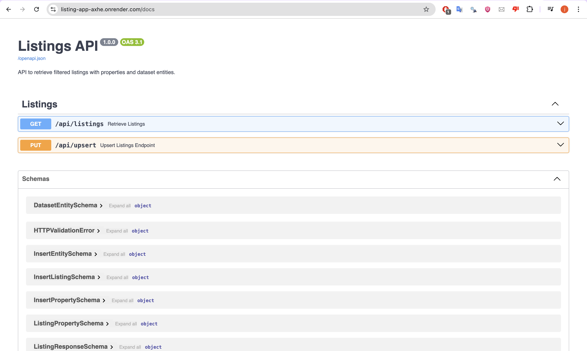

# listing-app

## Overview

This project provides a FastAPI backend for managing listings with structured properties and dataset entities. Below are the main sections in this README:

1. [Quickstart](#quickstart)
2. [Step-by-step Example - PUT and GET Endpoints](#step-by-step-example---put-and-get-endpoints)
3. [Relationships Between Tables](#relationships-between-tables)
4. [Migrations with Alembic](#migrations-with-alembic)
5. [Deployment Guide (Render + Neon)](#deployment-guide-render--neon)

## Quickstart

### 1. Fork or clone repository

### 2. Now you can run app
```bash
docker compose up --build
```

>Note: for a quick test you can access the deployed project https://listing-app-axhe.onrender.com/docs#/  <br><b>I am using the free tier on Render, they might spin down the service after some time of inactivity.

## Step by step example - PUT and GET endpoints

I have two endpoints in the project for managing listings: 

### 1. PUT /upsert
This endpoint accepts a JSON payload with listings data. It inserts new listings or updates existing ones, along with their associated properties and linked dataset entities.

Example Request (JSON Body):
```bash
{
  "listings": [
    {
      "listing_id": "listing_123",
      "scan_date": "2025-06-06T12:00:00",
      "is_active": true,
      "image_hashes": ["abc123", "def456"],
      "entities": [
        {
          "name": "entity_1",
          "data": {
            "type": "product",
            "category": "electronics"
          }
        }
      ],
      "properties": [
        {
          "name": "brand",
          "type": "str",
          "value": "Apple"
        },
        {
          "name": "is_featured",
          "type": "bool",
          "value": true
        }
      ]
    }
  ]
}
```

Response:
```bash
{
  "message": "Listings inserted/updated successfully."
}
```

### 2. GET /listings
This endpoint retrieves listings with various optional filters.

Query Parameters:
- listing_id: Filter by listing ID.
- scan_date_from / scan_date_to: Filter by scan date range.
- is_active: Filter by active status.
- image_hashes: Match any overlapping image hashes.
- dataset_entities: JSON string filter for entity data (e.g., {"category": "electronics"}).
- property_filters: JSON string of key-value property filters (e.g., {"brand": "Apple"}).
- page: Pagination (default: 1).

Example Request:
```bash
GET /api/listings?property_filters=%7B%22123%22:%20%22str%20value%22,%22456%22:%20false%7D
```
> `dataset_entities` and `property_filters` should be encoded because for GET requests
can’t have a body, and all data must be passed via the URL query string 


## Relationships between tables

```
+------------------+     1        *     +-------------------------+
|     Listing      |------------------>| StringPropertyValue     |
|------------------|                   |-------------------------|
| listing_id (PK)  |<------------------| listing_id (FK)         |
| scan_date        |     1        *     | property_id (FK)        |
| is_active        |                   | value (String)          |
| dataset_entity_ids|                  +-------------------------+
| image_hashes     |
|                  |     1        *     +-------------------------+
|                  |------------------>| BoolPropertyValue       |
|                  |<------------------| listing_id (FK)         |
+------------------+                   | property_id (FK)        |
                                       | value (Boolean)         |
                                       +-------------------------+

        ^                                      ^
        |                                      |
        |                                      |
        |            *                         * 
        |          (FK)                       (FK)
+------------------+                   +-------------------------+
|     Property     |<------------------| Property (shared)       |
|------------------|                   +-------------------------+
| property_id (PK) |
| name             |
| type             |
+------------------+

+------------------+
| DatasetEntity    |
|------------------|
| entity_id (PK)   |
| name             |
| data (JSON)      |
+------------------+
```

### Migrations with Alembic
I have used alembic to generate and run migration in the db. This was done through:

1. Initialize alembic
``` bash
alembic init alembic
```

2. Setup models: write models in app.models.schemas

3. Set `env.py` to import your models
``` python
from app.models.schemas import Base
target_metadata = Base.metadata
```

4. Create a new migration
``` bash
alembic revision --autogenerate -m "Add models" # this will autogenerate the obvious migration
```

5. Apply migrations
``` bash
alembic upgrade head
```

<b> New migration </b> <br>
For new models or changes in the schemas, we can generate a new file under versions
or autogenerate the changes. Then we can run the upgrade command to apply the changes.

## Deployment Guide (Render + Neon)

This project is deployed using:

🌐 Render to host the FastAPI application.

🛢️ Neon to host the PostgreSQL database.

The deployed app: https://listing-app-axhe.onrender.com/docs#/

### 🛠️ Steps to Deploy

#### 1. Prepare Neon PostgreSQL Database

- Go to [https://neon.tech](https://neon.tech) and create a new project.
- Create a new branch and database (or use the default).
- Copy the connection string.

#### 2. Setup Render

- Go to [https://render.com](https://render.com) and create a new Web Service.
- Connect your GitHub repo.
- For environment:
- **Build Command**:  
  ```bash
  pip install -r requirements.txt
  ```
- **Start Command**:  
  ```bash
  uvicorn app.main:app --host 0.0.0.0 --port 10000
  ```
- **Runtime**: Python 3.x
- **Environment Variables**:
  - `DATABASE_URL`: the Neon connection string you copied.

> <b>I am using the free tier on Render, they might spin down the service after some time of inactivity. Time of inactivity might be 15 minutes. I can restart the service on demand on the other hand.

